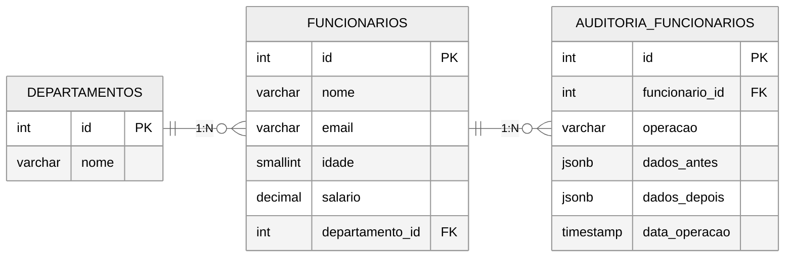

# Diagrama Entidade–Relacionamento (DER)

```mermaid
%%{init: {"theme":"neutral"}}%%
erDiagram
    direction LR

    DEPARTAMENTOS {
        int id PK
        varchar nome
    }

    FUNCIONARIOS {
        int id PK
        varchar nome
        varchar email
        smallint idade
        decimal salario
        int departamento_id FK
    }

    AUDITORIA_FUNCIONARIOS {
        int id PK
        int funcionario_id FK
        varchar operacao
        jsonb dados_antes
        jsonb dados_depois
        timestamp data_operacao
    }

    DEPARTAMENTOS ||--o{ FUNCIONARIOS : "1:N"
    FUNCIONARIOS ||--o{ AUDITORIA_FUNCIONARIOS : "1:N"

```