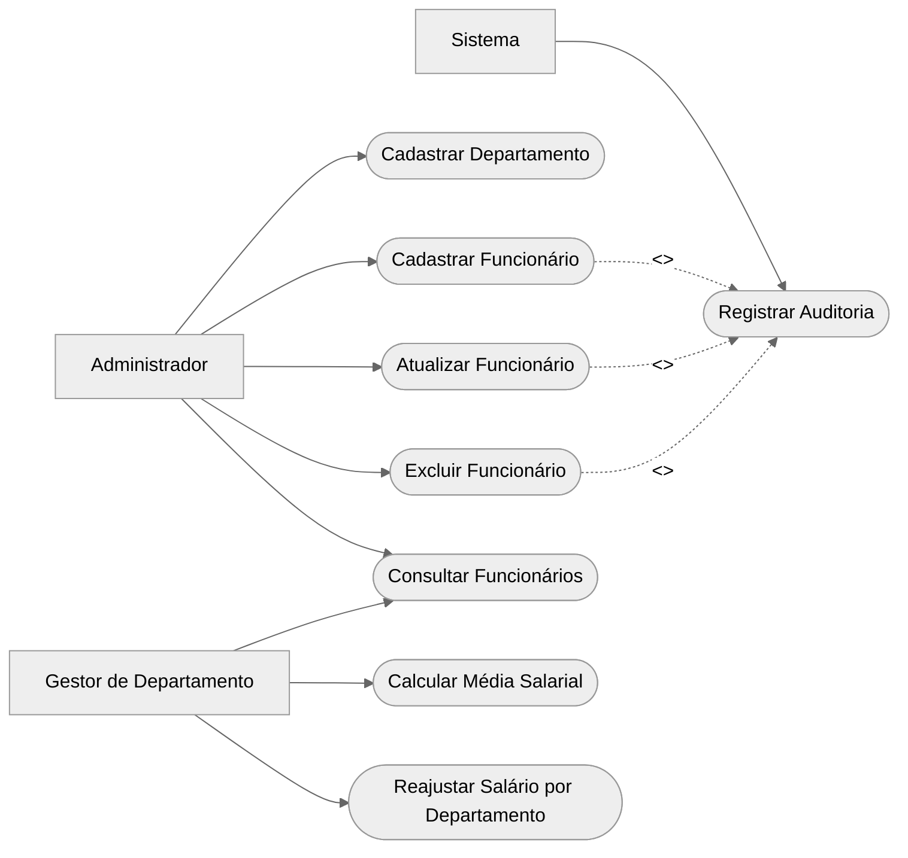

# Diagrama de Casos de Uso – UML

```mermaid
%%{init: {"theme":"neutral"}}%%
flowchart LR
    %% Atores
    Admin["Administrador"]
    Gestor["Gestor de Departamento"]
    Sistema["Sistema"]

    %% Casos de Uso
    CadastrarDepto(["Cadastrar Departamento"])
    CadastrarFunc(["Cadastrar Funcionário"])
    AtualizarFunc(["Atualizar Funcionário"])
    ExcluirFunc(["Excluir Funcionário"])
    ConsultarFunc(["Consultar Funcionários"])
    MediaSalarial(["Calcular Média Salarial"])
    ReajusteSalarial(["Reajustar Salário por Departamento"])
    Auditoria(["Registrar Auditoria"])

    %% Relações
    Admin --> CadastrarDepto
    Admin --> CadastrarFunc
    Admin --> AtualizarFunc
    Admin --> ExcluirFunc
    Admin --> ConsultarFunc

    Gestor --> ConsultarFunc
    Gestor --> MediaSalarial
    Gestor --> ReajusteSalarial

    Sistema --> Auditoria

    %% Includes
    CadastrarFunc -.->|<<include>>| Auditoria
    AtualizarFunc -.->|<<include>>| Auditoria
    ExcluirFunc -.->|<<include>>| Auditoria


```