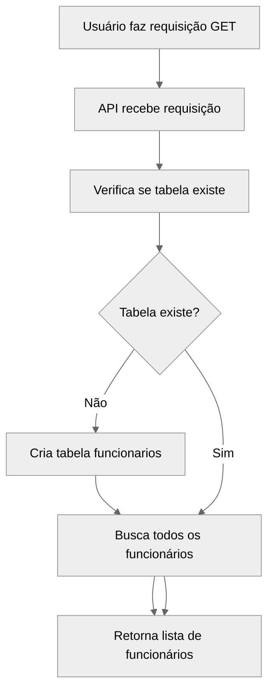
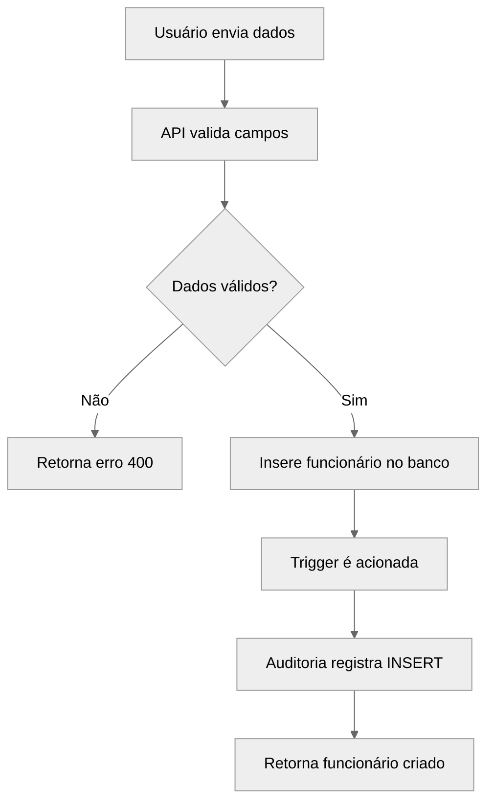
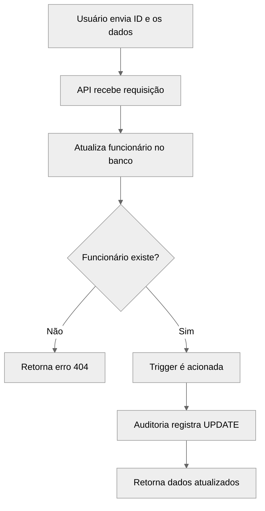
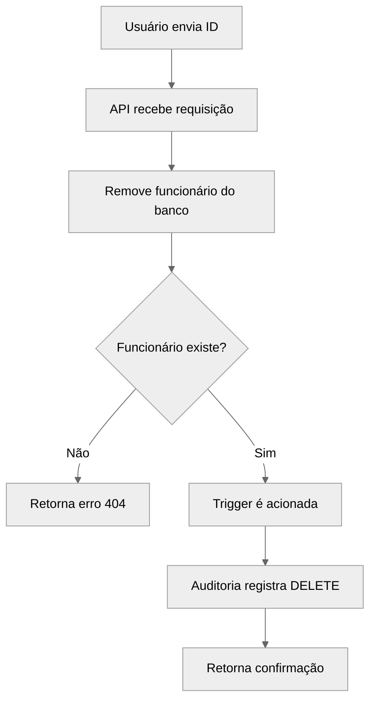
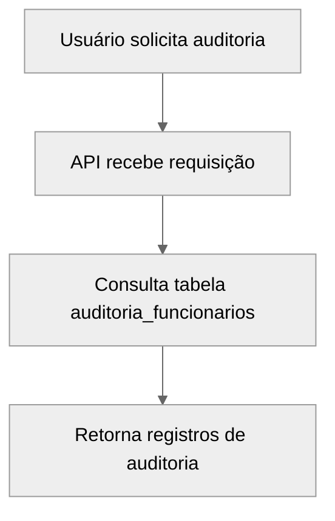
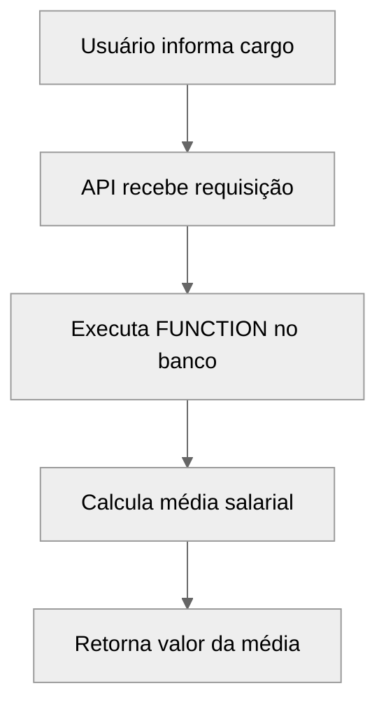
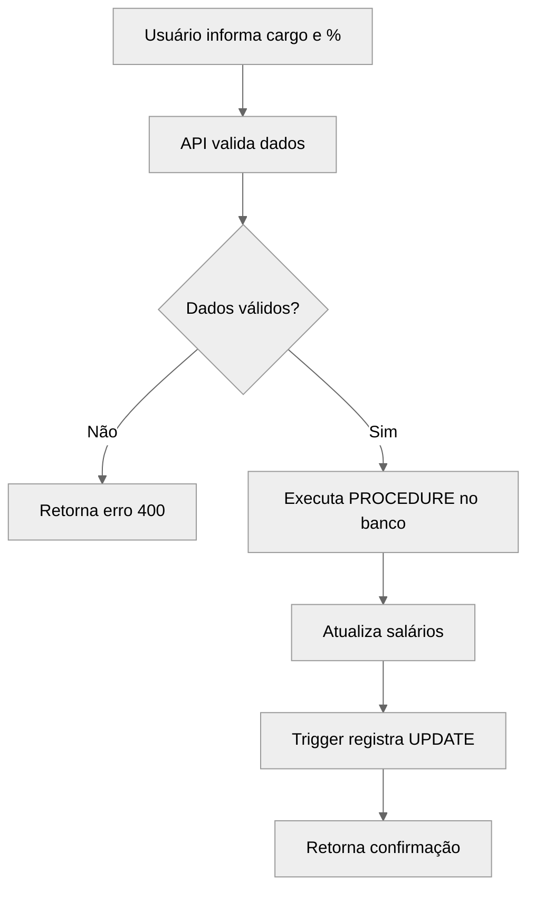

# Fluxos do Sistema RH

## Listar Funcionários

## Criar Funcionário

## Atualizar Funcionário

## Deletar Funcionário

## Consulta de Auditoria

## Média Salarial por Cargo

## Reajuste Salarial por Cargo
